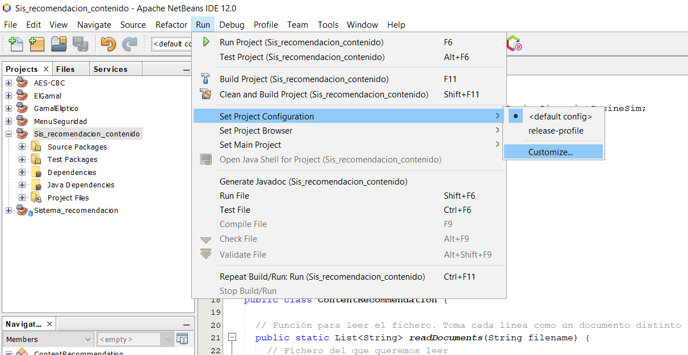
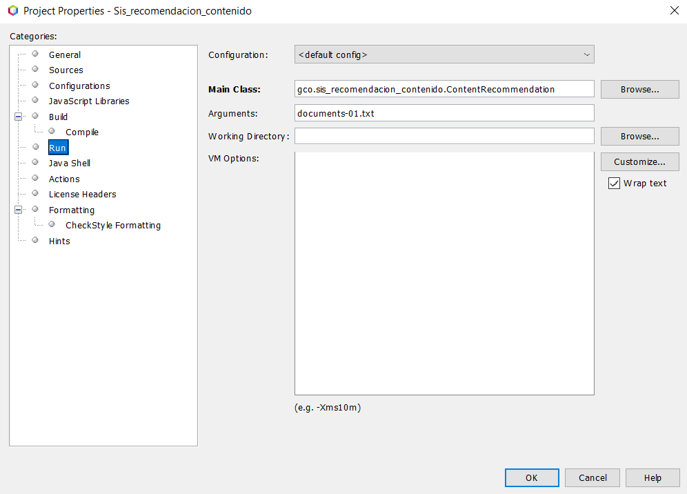
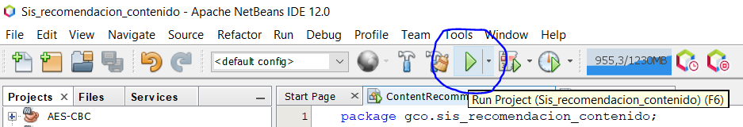

# Gestión del Conocimiento en las Organizaciones
## Práctica 5. Sistemas de recomendación. Modelos Basados en el Contenido

* Autor: Saúl Pérez García
#

### Ejemplo de uso:

Descargar el proyecto y probar su ejecución desde el IDE Netbeans siguiendo las siguientes instrucciones:

Se requiere para el funcinamiento del mismo 1 parámetro por línea de comandos. Este fichero será posteriormente segmentado por
cada una de sus líneas, siendo estas documentos distintos a analizar.

Dicho esto, y una vez descargado el proyecto, hay que seguir los siguientes pasos como se puede apreciar en la siguiente imagen:
 
 * **Run** --> **Set Project Configuration** --> **Customize** 

  
  
  
Tras esto, se abre una ventana emergente con una serie de opciones a la izquierda. Seleccione la opción **Run** y tendrá a la vista varias posibilidades. Lo primero es asegurar que la **Main Class** es correcta y acto seguido, introducir en el apartado **Arguments** los argumentos requeridos como se ve en la siguiente imagen:



Finalmente, solo restar presionar sobre la flecha verde (F6 dependiendo de la configuración del IDE) para compilar el proyecto:



#

### Ejemplo de ejecución:

* En línea de comandos:

```txt
documents-01.txt
```

### Salida por pantalla:


```txt
---------------------------------------------------
Resultado del Sistema de Recomentación de Contenido
---------------------------------------------------

|     ID   | |           Término   ||     TF     ||    IDF     ||   TF-IDF   |
|      0   | |            aromas   ||   0,0417   ||   0,3979   ||   0,0166   |
|      1   | |           include   ||   0,0417   ||   1,0000   ||   0,0417   |
|      2   | |          tropical   ||   0,0417   ||   1,0000   ||   0,0417   |
|      3   | |             fruit   ||   0,0417   ||   0,6990   ||   0,0291   |
|      4   | |             broom   ||   0,0417   ||   1,0000   ||   0,0417   |
|      5   | |         brimstone   ||   0,0417   ||   1,0000   ||   0,0417   |
|      6   | |               and   ||   0,0833   ||   0,0000   ||   0,0000   |
|      7   | |             dried   ||   0,0833   ||   0,6990   ||   0,0582   |
|      8   | |              herb   ||   0,0417   ||   0,6990   ||   0,0291   |
|      9   | |               the   ||   0,0417   ||   0,2218   ||   0,0092   |
|     10   | |            palate   ||   0,0417   ||   0,5229   ||   0,0218   |
|     11   | |             isn't   ||   0,0417   ||   1,0000   ||   0,0417   |
|     12   | |            overly   ||   0,0417   ||   1,0000   ||   0,0417   |
|     13   | |        expressive   ||   0,0417   ||   1,0000   ||   0,0417   |
|     14   | |          offering   ||   0,0417   ||   1,0000   ||   0,0417   |
|     15   | |         unripened   ||   0,0417   ||   1,0000   ||   0,0417   |
|     16   | |             apple   ||   0,0417   ||   0,6990   ||   0,0291   |
|     17   | |            citrus   ||   0,0417   ||   1,0000   ||   0,0417   |
|     18   | |              sage   ||   0,0417   ||   1,0000   ||   0,0417   |
|     19   | |         alongside   ||   0,0417   ||   1,0000   ||   0,0417   |
|     20   | |             brisk   ||   0,0417   ||   0,6990   ||   0,0291   |
|     21   | |           acidity   ||   0,0417   ||   0,1549   ||   0,0065   |


...


Similitud entre doc0 y doc 1: 0.0012346980965979237
Similitud entre doc0 y doc 2: 0.010388819029388149
Similitud entre doc0 y doc 3: 0.029454840729087498
Similitud entre doc0 y doc 4: 0.0021922432103337916
Similitud entre doc0 y doc 5: 0.03762550584614871
Similitud entre doc0 y doc 6: 0.06186637879100954
Similitud entre doc0 y doc 7: 0.0019495882042252085
Similitud entre doc0 y doc 8: 0.09896575260369413
Similitud entre doc0 y doc 9: 0.034592250548121664
Similitud entre doc1 y doc 2: 0.006072979553643399
Similitud entre doc1 y doc 3: 0.028104969310892732
Similitud entre doc1 y doc 4: 0.04673719634873126
Similitud entre doc1 y doc 5: 0.06268621204451308
Similitud entre doc1 y doc 6: 0.13402455187688483
Similitud entre doc1 y doc 7: 0.05008097343876344
Similitud entre doc1 y doc 8: 0.0388821092292138
Similitud entre doc1 y doc 9: 0.052256626518730864
Similitud entre doc2 y doc 3: 0.07166416499535831
Similitud entre doc2 y doc 4: 0.01169772500832483
Similitud entre doc2 y doc 5: 0.06708268070782182
Similitud entre doc2 y doc 6: 0.012361272808272454
Similitud entre doc2 y doc 7: 0.009420233921204803
Similitud entre doc2 y doc 8: 0.044507109055206974
Similitud entre doc2 y doc 9: 0.037862978924525295
Similitud entre doc3 y doc 4: 0.022009518357744555
Similitud entre doc3 y doc 5: 0.06531655041236256
Similitud entre doc3 y doc 6: 0.04995330497844086
Similitud entre doc3 y doc 7: 0.003710584212663366
Similitud entre doc3 y doc 8: 0.03168687837605879
Similitud entre doc3 y doc 9: 0.03623055671495996
Similitud entre doc4 y doc 5: 0.028013973461311483
Similitud entre doc4 y doc 6: 0.02148781842107425
Similitud entre doc4 y doc 7: 0.044652107682932776
Similitud entre doc4 y doc 8: 0.01062048972061201
Similitud entre doc4 y doc 9: 0.010983176712399071
Similitud entre doc5 y doc 6: 0.024558288766720313
Similitud entre doc5 y doc 7: 0.045349875534903425
Similitud entre doc5 y doc 8: 0.05978843387884764
Similitud entre doc5 y doc 9: 0.034149823084524106
Similitud entre doc6 y doc 7: 0.031124156251251603
Similitud entre doc6 y doc 8: 0.0499858969448692
Similitud entre doc6 y doc 9: 0.040375057549838944
Similitud entre doc7 y doc 8: 0.041831805569896886
Similitud entre doc7 y doc 9: 0.17008214638680752
Similitud entre doc8 y doc 9: 0.023109866230738626
```


#

### Descripción del código:

En este proyecto, se disponen de dos fucheros, cada uno contiene clases y métodos necesarios para el correcto funcionamiento del mismo. El objetivo de este apartado es dar una breve explicación a cada uno de ellos:

* Código principal

En el fichero del programa principal, ``ContentRecommendation.java`` hay dos clases, ``public class ContentRecommendation`` y la ``static class Tuple``.


La clase ContentRecommendation tiene los siguientes métodos:

- ``public static List<String> readDocuments(String filename)``. Este método lee el fichero pasado como parámetro y convierte cada línea del mismo en un documento que se va a almacenar en una **LinkedList** para su posterior análisis. También tiene un código try-catch para la gestión de errores.

- ``public static Tuple<List<List<String>>, List<String>, List<Map<Integer, Double>>> tfTokenizeDocuments(List<String> documents)``. Este método primeramente describe una expresión regular para poder realizar una correcta separación de palabras, considerando que los guiones y la comilla para contraer palabras en inglés deben ser consideradas.

Tras esto, es necesario recorrer cada una de las líneas que se habían almacenado anteriormente. Se considerará como "match" aquel término que no haya sido leído anteriormente, añadiéndolo a la lista y asignándole un índice. En caso de que el mismo término vuelva a ser encontrado, no se le asignará de nuevo un índice distinto.

Luego, necesitaremos conocer las veces que un término aparece para el cálculo de la frequencia, por lo que vamos a tener un contador que aumentará cada vez que se repita, dentro de un __HashMap__ llamado **freq**.

Finalmente, se devolverá una tupla **"t"** que tendrá:
```java
    t.e1 = result;      // Valor del índice
    t.e2 = terms;       // término en concreto
    t.e3 = tf;          // valor del TF
```

- ``public static List<Double> idf(Tuple<List<List<String>>, List<String>, List<Map<Integer, Double>>> t)``. Este método nos servirá para el cálculo del IDF. Lo primero que haremos en este método será almacenar el número de documentos que pueden ser recomendados en una variable **N**.
Lo siguiente a tener en cuenta es el número de documentos en N en los que un término concreto, que llamaremos X aparece. Esta información la vamos a almacenar en una variable llamada **dfx**.

Finalmente, para obtener el resultado final se debe realizar el logaritmo en base diez entre **N** y **dfx** que será lo que devuelva el método.

- ``public static double[][] tfIdf(List<Map<Integer, Double>> tf, List<Double> idf, int uniqueTerms)``. El siguiente método realizará el cálculo del TF-IDF. Para resolver este cálculo, se emplea un vector con dos pares ``double[][] tfIdf = new double[numDocs][uniqueTerms]`` donde se tiene el número de documentos y el número de términos sin repetir y vamos a multplicar simplemente los pares de valores de cada uno hast obtener el resultado, es decir, cada término tendrá como resultado la multiplicación de su valor TF y su valor IDF calculados anteriormente.

- ``public static void printTable(List<List<String>> docTokens, List<String> docTerms, List<Map<Integer, Double>> tf, List<Double> idf, double[][] tfIdf)``. Este método imprime en formato de tabla el índice, término, TF,  IDF y TF-IDF correspondiente a cada palabra de cada documento.

Además, esta clase contiene la otra clase:

- ``static class Tuple<T1, T2, T3>``. Clase auxiliar para poder representar una Tupla.

Finalmente en el **main** llamamos a los métodos implemetados y explicados anteriormente para resolver la práctica.


* CosineSim.java

Este fichero contiene la clase ``public class CosineSim`` con dos métodos que serán los encargados de poder realizar la similitud coseno entre los distintos documentos.

- ``public static double cosineSim(double[] doc1, double[] doc2)``. Este método va a realiza el cálculo de un producto escalar entre los vectores a y b, siendo estos dos documentos y en su denominador, se tiene la multiplicación de los módulos de ambos vectores.
Dentro de un bucle for, se van a realizar los cálculos para cada posición iésima de los mismos y finalmente se hará la correspondiente división dando como resultado el valor deseado.

- ``public static void printCosineSim(double[][] tfIdf)``. El último método se encarga de mostrar la similitud coseno calculada entre dos documentos hasta que ya no queden documentos por comparar.
